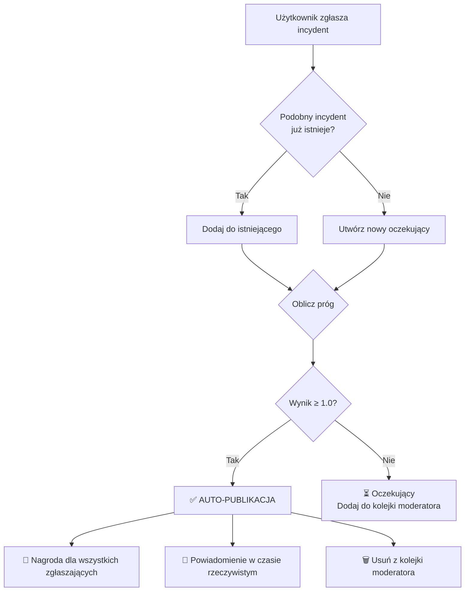

# System Progów - Jak Działa Automatyczna Publikacja Incydentów

## Podstawowa Koncepcja

System wykorzystuje **algorytm ważonego punktowania**, który łączy **reputację użytkowników** i **liczbę zgłoszeń**, aby określić, kiedy oczekujący incydent powinien automatycznie stać się oficjalnym.

## Formuła

```
Aktualny Wynik = (Wynik Zgłoszeń × 40%) + (Wynik Reputacji × 60%)
```

Incydent staje się **oficjalny**, gdy `Aktualny Wynik ≥ 1.0` (100%)

## Konfiguracja (DEFAULT_THRESHOLD_CONFIG)

```typescript
{
  baseReportCount: 3,              // Wymagane minimum 3 zgłoszenia
  baseReputationRequired: 100,     // Wymagane łącznie 100 punktów reputacji
  reputationWeight: 0.6,           // 60% wagi na reputację
  reportWeight: 0.4,               // 40% wagi na liczbę zgłoszeń
  minReputationPerUser: 10,        // Użytkownicy potrzebują ≥10 reputacji aby się liczyć
  highReputationBonus: 0.25,       // 25% bonus dla użytkowników z wysoką reputacją
  highReputationThreshold: 100     // 100+ reputacji to "wysoka reputacja"
}
```

## Szczegółowe Obliczenia

### 1. **Wynik Zgłoszeń** (40% wagi)

```
Wynik Zgłoszeń = min(Liczba Ważnych Zgłaszających / 3, 1.0)
```

- 1 zgłaszający = 0.33 → 33%
- 2 zgłaszających = 0.67 → 67%
- 3 zgłaszających = 1.00 → 100%

### 2. **Wynik Reputacji** (60% wagi)

```
Wynik Reputacji = min(Suma Reputacji / 100, 1.0)
```

**Z bonusem za wysoką reputację** (użytkownicy z ≥100 reputacji):

- Bonus = (Liczba Wysoko-Rep / Łączna Liczba) × 25%
- Wynik = min(Bazowy Wynik × (1 + Bonus), 1.5)

### 3. **Końcowe Połączenie**

```
Aktualny Wynik = (Wynik Zgłoszeń × 0.4) + (Wynik Reputacji × 0.6)
```

## Przykładowe Scenariusze

### **Scenariusz 1: 3 Nowych Użytkowników (Domyślnie 34 Rep Każdy)**

```
Suma Reputacji: 3 × 34 = 102
Wynik Zgłoszeń: 3/3 = 1.0 → 100%
Wynik Reputacji: 102/100 = 1.02 → 100% (ograniczony)

Aktualny Wynik = (1.0 × 0.4) + (1.0 × 0.6) = 1.0 ✅ OFICJALNY
```

**Wynik:** 3 nowych użytkowników może natychmiast opublikować incydent!

### **Scenariusz 2: 2 Użytkowników z Wysoką Reputacją (150 rep każdy)**

```
Suma Reputacji: 300
Wynik Zgłoszeń: 2/3 = 0.67 → 67%
Wynik Reputacji: 300/100 = 3.0 → ograniczony do 1.0 → 100%
Bonus za Wysoką Rep: (2/2) × 0.25 = 25% → Wynik = 1.0 × 1.25 = 1.25

Aktualny Wynik = (0.67 × 0.4) + (1.25 × 0.6) = 0.268 + 0.75 = 1.018 ✅ OFICJALNY
```

**Wynik:** 2 zaufanych użytkowników wystarczy do publikacji!

### **Scenariusz 3: 1 Użytkownik (34 Rep)**

```
Suma Reputacji: 34
Wynik Zgłoszeń: 1/3 = 0.33 → 33%
Wynik Reputacji: 34/100 = 0.34 → 34%

Aktualny Wynik = (0.33 × 0.4) + (0.34 × 0.6) = 0.132 + 0.204 = 0.336 ❌ OCZEKUJĄCY
```

**Wynik:** Pojedynczy użytkownik nie może sam opublikować incydentu (zapobiega spamowi).

### **Scenariusz 4: 2 Użytkowników (34 Rep każdy)**

```
Suma Reputacji: 68
Wynik Zgłoszeń: 2/3 = 0.67 → 67%
Wynik Reputacji: 68/100 = 0.68 → 68%

Aktualny Wynik = (0.67 × 0.4) + (0.68 × 0.6) = 0.268 + 0.408 = 0.676 ❌ OCZEKUJĄCY
```

**Wynik:** 2 użytkowników to za mało, potrzebny 3. lub moderator.

## Filtry i Zabezpieczenia

### **1. Filtr Minimalnej Reputacji**

Użytkownicy z reputacją <10 nie są liczeni do progu:

- Zapobiega to spamowi z nowych kont
- Zachęca do budowania reputacji

### **2. Zapobieganie Duplikatom**

Ten sam użytkownik nie może zgłosić tego samego incydentu dwa razy:

```typescript
if (existingPending.reporterIds.some((id) => id.equals(userId))) {
  throw new Error("Już zgłosiłeś ten incydent");
}
```

### **3. Okresy Cooldown**

| Typ Cooldown    | Czas     | Opis                  |
| --------------- | -------- | --------------------- |
| **Lokalizacja** | 5 minut  | Ten sam obszar GPS    |
| **Rodzaj**      | 3 minuty | Ten sam typ incydentu |
| **Ogólny**      | 1 minuta | Dowolne zgłoszenie    |

### **4. Limity Rate (Limitowanie Częstotliwości)**

**Użytkownicy zwykli:**

- 2 zgłoszenia / minutę
- 10 zgłoszeń / godzinę
- 50 zgłoszeń / dzień

**Administratorzy:**

- 10 zgłoszeń / minutę
- 100 zgłoszeń / godzinę
- 1000 zgłoszeń / dzień

## Co Się Dzieje Gdy Próg Jest Osiągnięty



### **Automatyczna Publikacja:**

1. ✅ **Publikacja incydentu** → Dodany do kolekcji `Incidents`
2. 🎁 **Nagrody reputacji** → Wszyscy zgłaszający otrzymują punkty
3. 📢 **Powiadomienie w czasie rzeczywistym** → Subskrypcja GraphQL wysyła update
4. 🗑️ **Czyszczenie kolejki** → Wpis moderatora jest usuwany (jeśli istnieje)

**Nagrody reputacji:**

```typescript
// Przykładowe nagrody
const baseReward = 5; // Bazowa nagroda za zgłoszenie
const bonusMultiplier = 1.0; // Mnożnik bonusu

// Każdy zgłaszający otrzymuje:
reputationGained = baseReward * bonusMultiplier;
```

## Nadpisanie Przez Moderatora

Jeśli próg **nie jest osiągnięty**, moderatorzy mogą:

### **Zatwierdzić Ręcznie** ✅

```typescript
await moderatorApproveReport(pendingIncidentId, moderatorId);
```

- Incydent jest publikowany
- Zgłaszający otrzymują takie same nagrody jak przy auto-publikacji
- Powód: `MODERATOR_APPROVED`

### **Odrzucić** ❌

```typescript
await moderatorRejectReport(pendingIncidentId, moderatorId, reason);
```

- Incydent jest usuwany
- Zgłaszający **nie otrzymują** nagród
- Zapobiega to fałszywym zgłoszeniom

## Priorytety w Kolejce Moderatora

System automatycznie przypisuje priorytety:

| Rodzaj Incydentu                 | Priorytet     | Ikona |
| -------------------------------- | ------------- | ----- |
| ACCIDENT (Wypadek)               | **WYSOKI** 🚨 | 🚨    |
| VEHICLE_FAILURE (Awaria pojazdu) | **WYSOKI** ⚠️ | ⚠️    |
| TRAFFIC_JAM (Korek)              | **ŚREDNI** 🚗 | 🚗    |
| NETWORK_FAILURE (Awaria sieci)   | **NISKI** 📡  | 📡    |
| PLATFORM_CHANGES (Zmiana peronu) | **NISKI** 🚉  | 🚉    |
| INCIDENT (Inny)                  | **NISKI** ❗  | ❗    |

## Dlaczego Domyślna Reputacja to 34?

```
3 użytkowników × 34 reputacji = 102 punktów
102 ≥ 100 (wymagane) → ✅ Osiągnięty próg
```

To **sweet spot**, który:

- ✅ Umożliwia 3 nowym użytkownikom publikację (demokracja)
- ✅ Zapobiega jednoosobowemu spamowi
- ✅ Zachęca do współpracy
- ✅ Utrzymuje jakość zgłoszeń

## Podsumowanie

System progów to **inteligentny balans** między:

- 🚀 **Szybkością** → 3 zaufanych użytkowników może natychmiast opublikować
- 🛡️ **Jakością** → Zapobiega spamowi od pojedynczych użytkowników
- 🤝 **Współpracą** → Zachęca do wspólnego zgłaszania
- ⚖️ **Sprawiedliwością** → Użytkownicy z wyższą reputacją mają większy wpływ

**Formuła 60/40** daje większą wagę reputacji, co nagradza aktywnych i rzetelnych użytkowników, jednocześnie wymagając współpracy społeczności do publikacji incydentów.
